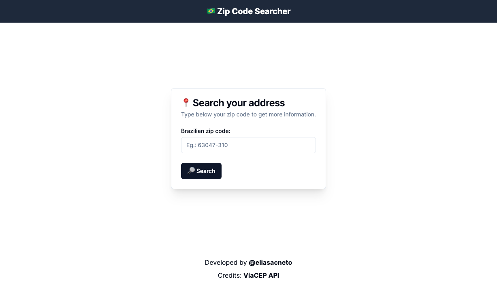
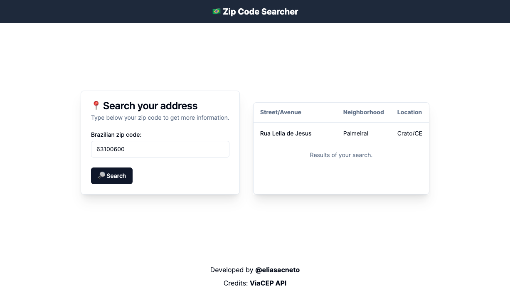

# 🇧🇷 Brazilian Zip Code Searcher

This project is a simple web application developed with Next.js and TypeScript, allowing users to retrieve address information based on a zip code using the ViaCEP API.

Check it out [live demo](https://zipcodesearcher.vercel.app).

## Features

- Zip Code Search: Enter a zip code and retrieve address information.
- Zip Code Mask: Automatic formatting of the zip code as the user types.
- Loading Indicator: Indicates when the API request is in progress.
- Zip Code Validation: Ensures only valid zip codes are accepted.

## Technologies Used

- Next.js
- TypeScript
- Tailwind CSS
- SHADCN UI
- ViaCEP API

## Screenshots




## How to Run the Project

### Prerequisites

- Node.js
- npm or yarn

### Steps to Run

1. Clone the repository:

   ```bash
   git clone https://github.com/eliasacneto/zipcode-searcher.git
   cd zipcode-searcher
   ```

2. Install dependencies:

   ```bash
   npm install
   ```

   or

   ```bash
   yarn install
   ```

3. Run the project:

   ```bash
   npm run dev
   ```

   or

   ```bash
   yarn dev
   ```

4. Access the application:
   Open http://localhost:3000 in your browser.

## Code Functionality

### Main Component

- `page.tsx`: Contains the main component managing the zip code state, API data retrieval, and result display.

### Main Functions

- `handleChange`: Updates the zip code state and applies formatting mask.
- `handleSearch`: Makes request to ViaCEP API, handles results, and updates component state.

## How to Contribute

1. Fork the project.
2. Create a new branch: `git checkout -b my-feature`
3. Make your changes and commit: `git commit -m 'My new feature'`
4. Push to your fork: `git push origin my-feature`
5. Submit a Pull Request.

## License

This project is licensed under the MIT License. See the [LICENSE](LICENSE) file for more information.
